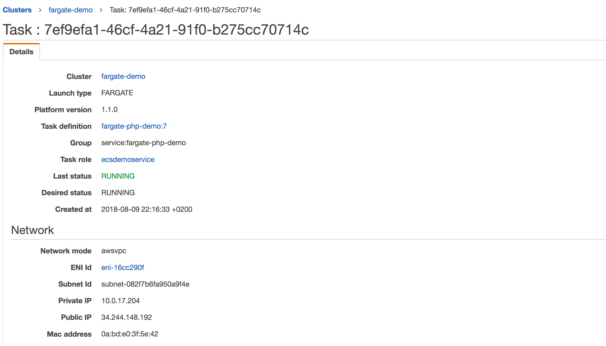
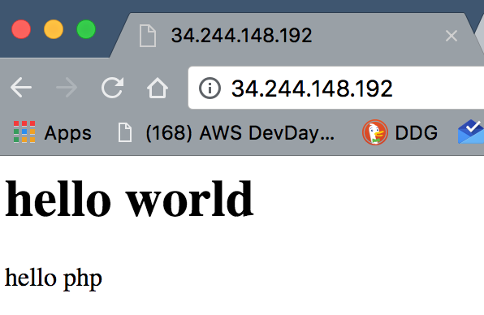

# Fargate Demo with CloudFormation and AWS cli

This project shows the creation of a php fargate container with all neccesary resources done automatically. This is done with a combination of **CloudFormation** and the AWS **cli**. For the purpose of beeing only a showcasethe architecture is overly simplified. 

The **CloudFormation** templates are derived from [A reference architecture for deploying containerized microservices with Amazon ECS and AWS CloudFormation (YAML)
](https://github.com/aws-samples/ecs-refarch-cloudformation).

Everything can be created and monitored with a bash console session. Tested on mac os.

With modularized **CloudFormation** templates you can change the resources which change more often like **Security Groups** without changing any of the base templates like the **vpc** in this example.

The **VPC** is only setup for demonstration purposes. You should not use only public subnet in production. The Load Balancer is left out to keep the example simple.

## Overview


## Creation

### Preperation

- set Region in environment: e.g. `export AWS_DEFAULT_REGION=eu-west-1`
- install clouds: e.g. `pip install clouds-aws`
- have AWS credentials installed
- checkout project
- have docker installed and started
- replace "123456789012" in `ecs/tasks/taskdef-php.json` with your account number.

### Creation of resources

To see all steps defined in the Makefile, type `make help`

**Infrastructure**

1) `make deploy-vpc` 
    Install complete VPC defined in CloudFormation template stacks/vpc/template.yaml with Internet Gateway etc. Takes about 1 min. With Nat Gateways it would be about 5 min.

2) `make deploy-security-groups`
    Takes less than 1 min.

3) `make deploy-iam-ecs-service`
    Takes approx. 30 sec.

4) `make deploy-cluster` 
    Create the Amazon ECS Cluster. Takes approx. 5 min.

5) `make deploy-ecr` 
    Create the Container Registry ECR.  Takes approx. 1 min.

**Image, Task and service**

6) `make deploy-docker`
    - build Docker image
    - tag image
    - login into the **ECR**
    - push image to **ECR**
    Time *really* depends on the internet connection and the computer power. Between 1 and 30 min.

7) `make update-task` 
    Upload the task definition defined in `./ecs/task/taskef-php.json`. The task **fargate-php-demo** is created.

8) `make create-service` 
    Create the service with one running container.
    If you try to create all resources with `make deploy-all` it will not work the first time. This is because the security-groups are evaluated when `make` starts. At starting time the security-group stack is not established yet. So you have to start `make deploy-all` twice.

## Connection to the Web service

Now you get the ip adress from the Task Detail page:
.

You should see something like this: 

Now you can test the fargate service with different settings.

Dont forget to clean up like described now in "Deteletion"

## Challenges

- change the `./docker/src/index.php` 
    - redeploy container with new version
- add an Load Balancer with console
- convert it to **CloudFormation**
- Start another service in the other availability zone
- Move the container to a private subnet
  - dont forget nat gateways

## Deletion

Delete in reverse order, as shown by `make help` which shows the necesarry numbers in order.

## Tools

### Dockerfile

The Dockerfile is created in `./docker`. Its an php image. In `./docker/src/index.php` is a very small php file which will run in the fargate container.

[Php Image](https://hub.docker.com/_/php/)

## Clouds-aws

This is a small and handy tool to manage multiple **CloudFormation** templates.
The templates are defined in subdirectories of `./stacks`.

Example session:
```bash
make deploy-security-groups
clouds -r eu-west-1 update   -c --events security-groups
2018-08-09/18:52:16 CREATE_IN_PROGRESS	AWS::CloudFormation::Stack	security-groups	User Initiated
2018-08-09/18:52:18 CREATE_IN_PROGRESS	AWS::EC2::SecurityGroup  	LambdaSG
2018-08-09/18:52:19 CREATE_IN_PROGRESS	AWS::EC2::SecurityGroup  	WebserviceSG
2018-08-09/18:52:19 CREATE_IN_PROGRESS	AWS::EC2::SecurityGroup  	LambdaSG	Resource creation Initiated
2018-08-09/18:52:19 CREATE_IN_PROGRESS	AWS::EC2::SecurityGroup  	WebserviceSG	Resource creation Initiated
2018-08-09/18:52:21 CREATE_COMPLETE   	AWS::EC2::SecurityGroup  	WebserviceSG
2018-08-09/18:52:21 CREATE_COMPLETE   	AWS::EC2::SecurityGroup  	LambdaSG
2018-08-09/18:52:23 CREATE_COMPLETE   	AWS::CloudFormation::Stack	security-groups
```

## Authors

- Author: G.Glawe (gglawe@tecracer.de)
